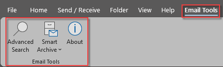
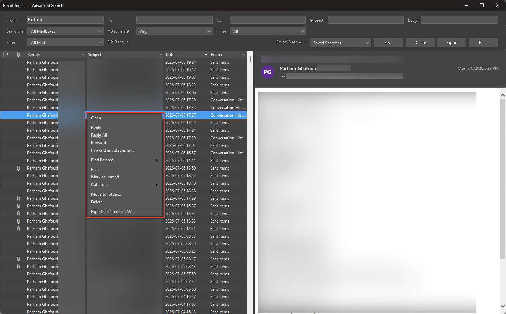
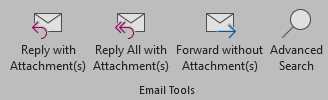
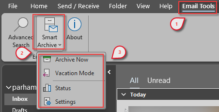
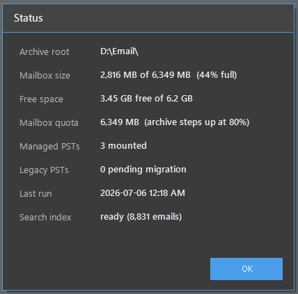
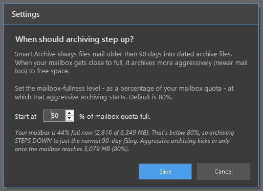
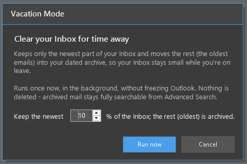

  <a href="README.md">English</a> &nbsp;|&nbsp;
  <a href="README.fa.md"><strong>فارسی</strong></a>

  

<h1 align="center">ابزارهای ایمیل برای مایکروسافت اوت‌لوک</h1>

  <strong>سریع‌تر پیدا کنید. امن‌تر بایگانی کنید. با پیوست‌ها یک‌کلیکی پاسخ بدهید.</strong> 
  یک افزونهٔ تمیز و کاربردی برای اوت‌لوک: جست‌وجوی پیشرفته، بایگانی هوشمند، عملیات گروهی، کار با پیوست‌ها، پاک‌سازی یادآورها و به‌روزرسانی خودکار و تأییدشده.

  
  
  
  
  

  <a href="https://github.com/ParhamGhafouri/EmailTools/releases/latest/download/EmailTools_Setup.rar"><strong>دانلود آخرین بستهٔ نصب‌کننده</strong></a>
   
  فقط برای حساب ویندوز شما نصب می‌شود. دسترسی مدیر نمی‌خواهد. بعد از بستن اوت‌لوک خودش را به‌روز می‌کند.

  اگر Email Tools در وقتتان صرفه‌جویی کرد، به <a href="https://github.com/ParhamGhafouri/EmailTools">مخزن ستاره بدهید</a>. این کار کمک می‌کند کاربران بیشتری پیدایش کنند.

---

<h2 dir="rtl" align="right">چرا ساخته شده؟</h2>

اوت‌لوک برای ایمیل عالی است، اما بعضی کارهای تکراری هنوز سخت و زمان‌برند: پیدا کردن گفت‌وگوهای قدیمی بین چند آرشیو، پاسخ دادن همراه با پیوست‌های قبلی، خلوت کردن صندوق قبل از مرخصی، و مرتب نگه داشتن فایل‌های PST. <strong>Email Tools</strong> همین گردش‌کارها را مستقیم به ریبون اوت‌لوک اضافه می‌کند؛ بدون دسترسی مدیر، بدون سرور، و بدون ارسال محتوای ایمیل به بیرون.

  

<h2 dir="rtl" align="right">تور محصول</h2>

<h3 dir="rtl" align="right">جست‌وجوی پیشرفته</h3>

یک پنجرهٔ اختصاصی برای جست‌وجوهای جدی: فیلدها بالا، نتایج قابل مرتب‌سازی در سمت چپ، و پیش‌نمایش زنده به سبک اوت‌لوک در سمت راست.

  
   
  همهٔ صندوق‌ها و آرشیوها را بگردید، پیام را پیش‌نمایش کنید، و روی یک نتیجه یا صدها نتیجه عملیات انجام دهید.

<ul dir="rtl" align="right">
  <li>ترکیب فیلترهای <strong>فرستنده</strong>، <strong>گیرنده</strong>، <strong>رونوشت</strong>، <strong>موضوع</strong> و <strong>متن پیام</strong>.</li>
  <li>جست‌وجو در پوشهٔ فعلی، کل صندوق، یا آرشیوهای متصل.</li>
  <li>محدود کردن نتایج با پیوست، بازهٔ زمانی، وضعیت پرچم‌دار و جست‌وجوهای ذخیره‌شده.</li>
  <li>عملیات راست‌کلیک: باز کردن، پاسخ، فوروارد، پرچم، دسته‌بندی، انتقال، حذف، یافتن پیام‌های مرتبط و خروجی CSV.</li>
</ul>

<h3 dir="rtl" align="right">عملیات پیوست</h3>

سه دکمهٔ متمرکز روی زبانهٔ Home اضافه می‌شود؛ درست همان‌جایی که کاربر با ایمیل کار می‌کند.

  

<ul dir="rtl" align="right">
  <li><strong>Reply with Attachment(s)</strong> فایل‌های اصلی را در پاسخ نگه می‌دارد.</li>
  <li><strong>Reply All with Attachment(s)</strong> همان کار را برای همهٔ گیرندگان انجام می‌دهد.</li>
  <li><strong>Forward without Attachment(s)</strong> فایل‌های پیوست را حذف می‌کند، اما تصاویر درون‌خطی امضا را نگه می‌دارد.</li>
</ul>

<h3 dir="rtl" align="right">بایگانی هوشمند</h3>

Smart Archive صندوق را سبک نگه می‌دارد و ایمیل‌های قدیمی را به آرشیوهای فصلی محلی مثل <code>2026-Season1</code> منتقل می‌کند. ایمیل‌ها جابه‌جا می‌شوند، نه حذف؛ و پوشه‌های محافظت‌شدهٔ اوت‌لوک دست‌نخورده می‌مانند.

  

<ul dir="rtl" align="right">
  <li>روزی یک‌بار، چند ثانیه بعد از باز شدن اوت‌لوک، آرام اجرا می‌شود.</li>
  <li>ایمیل‌های قدیمی را در گام‌های کوچک پس‌زمینه بایگانی می‌کند تا اوت‌لوک روان بماند.</li>
  <li>وقتی صندوق به سقف حجم نزدیک می‌شود، بایگانی را جدی‌تر انجام می‌دهد.</li>
  <li>آرشیوهای قدیمی PST را به آرشیو فصلی درست منتقل می‌کند و فقط بعد از تأیید خالی بودن، منبع قدیمی را برمی‌دارد.</li>
</ul>

<table>
  <tr>
    <td align="center" width="50%" dir="rtl">
       
      وضعیت سلامت آرشیو، PSTهای متصل، سهمیهٔ صندوق، فضای آزاد، آخرین اجرا و آماده بودن ایندکس جست‌وجو.
    </td>
    <td align="center" width="50%" dir="rtl">
       
      تنظیمات مشخص می‌کند بایگانی از چه درصدی از حجم صندوق جدی‌تر وارد عمل شود.
    </td>
  </tr>
</table>

<h3 dir="rtl" align="right">حالت مرخصی</h3>

قبل از مرخصی صندوق ورودی را خلوت کنید، بدون از دست دادن ایمیل‌ها. Vacation Mode جدیدترین بخش Inbox را نگه می‌دارد و ایمیل‌های قدیمی‌تر را به آرشیوهای تاریخ‌دار منتقل می‌کند.

  

<h3 dir="rtl" align="right">پاک‌سازی یادآورها</h3>

یادآورهای دیرشدهٔ جلسه‌هایی که تمام شده‌اند، بی‌سروصدا رد می‌شوند تا هر صبح روی هم تلنبار نشوند.

<h3 dir="rtl" align="right">به‌روزرسانی خودکار تأییدشده</h3>

Email Tools روزی یک‌بار GitHub Releases را بررسی می‌کند و نسخهٔ جدید را بعد از بستن اوت‌لوک بی‌صدا نصب می‌کند. نصب‌کننده قبل از اجرا با SHA-256 و امضای دیجیتال سنجاق‌شده بررسی می‌شود.

---

<h2 dir="rtl" align="right">نصب</h2>

<ol dir="rtl" align="right">
  <li>فایل <code>EmailTools_Setup.rar</code> را از <a href="https://github.com/ParhamGhafouri/EmailTools/releases/latest/download/EmailTools_Setup.rar">آخرین نسخه</a> دانلود کنید.</li>
  <li>آرشیو را استخراج کنید و <code>EmailTools_Setup.exe</code> را اجرا کنید.</li>
  <li>اوت‌لوک را باز کنید. زبانهٔ <strong>Email Tools</strong> و دکمه‌های پیوست روی زبانهٔ Home ظاهر می‌شوند.</li>
</ol>

نصب فقط برای حساب کاربری شما انجام می‌شود، دسترسی مدیر نمی‌خواهد، و اگر اوت‌لوک باز باشد خودش آن را می‌بندد. برای تعمیر یا حذف، دوباره <code>EmailTools_Setup.exe</code> را اجرا کنید یا از مسیر <strong>Settings → Apps</strong> حذفش کنید.

<blockquote dir="rtl">
در اولین اجرا، Smart Archive ممکن است یک مرتب‌سازی کوتاه در پس‌زمینه انجام دهد و ایندکس جست‌وجو شروع به ساخته‌شدن کند. هر دو در گام‌های کوچک اجرا می‌شوند تا اوت‌لوک قابل استفاده بماند.
</blockquote>

---

<h2 id="پیشنیازها" dir="rtl" align="right">پیش‌نیازها</h2>

<table dir="rtl" width="100%">
  <tr><td><strong>سیستم‌عامل</strong></td><td>ویندوز ۱۰ یا ویندوز ۱۱</td></tr>
  <tr><td><strong>اوت‌لوک</strong></td><td>Microsoft Outlook 2016، 2019، 2021 یا Microsoft 365 نسخهٔ دسکتاپ</td></tr>
  <tr><td><strong>فریم‌ورک</strong></td><td>.NET Framework 4.8</td></tr>
  <tr><td><strong>سطح دسترسی</strong></td><td>هیچ. نصب در سطح کاربر انجام می‌شود.</td></tr>
</table>

 

---

<h2 dir="rtl" align="right">حریم خصوصی و ایمنی</h2>

<ul dir="rtl" align="right">
  <li>جست‌وجو، بایگانی و ایندکس‌سازی ایمیل‌ها روی کامپیوتر خودتان انجام می‌شود.</li>
  <li>محتوای صندوق پستی جایی آپلود نمی‌شود.</li>
  <li>تنها ارتباط شبکه‌ای، بررسی به‌روزرسانی از GitHub Releases است.</li>
  <li>به‌روزرسانی فقط وقتی پذیرفته می‌شود که هش نصب‌کننده و گواهی امضای دیجیتال با مقدارهای مورد انتظار یکی باشد.</li>
</ul>

---

<h2 dir="rtl" align="right">پرسش‌های پرتکرار</h2>

<strong>Smart Archive ایمیل‌ها را حذف می‌کند؟</strong> 
نه. فقط ایمیل‌های قدیمی را به آرشیوهای محلی منتقل می‌کند. پوشه‌هایی مثل Calendar، Contacts، Tasks، Notes، Drafts، Outbox، Deleted Items و Conversation History بایگانی نمی‌شوند.

<strong>دسترسی مدیر لازم دارد؟</strong> 
نه. همه‌چیز زیر حساب ویندوز خودتان نصب می‌شود.

<strong>ایمیل‌های بایگانی‌شده قابل جست‌وجو هستند؟</strong> 
بله. آرشیوهای فصلی داخل اوت‌لوک متصل می‌مانند و از Advanced Search قابل جست‌وجو هستند.

---

<h2 dir="rtl" align="right">تغییرات</h2>

برای تاریخچهٔ نسخه‌ها و یادداشت‌های انتشار، صفحهٔ <a href="https://github.com/ParhamGhafouri/EmailTools/releases">Releases</a> را ببینید.

---

<h2 align="center" dir="rtl">از Email Tools راضی هستید؟</h2>

  <a href="https://github.com/ParhamGhafouri/EmailTools"><strong>در گیت‌هاب ستاره بدهید</strong></a> 
  ساده‌ترین راه برای حمایت از پروژه و کمک به دیده‌شدن بیشتر آن است.

---

  <strong>طراحی و توسعه: پرهام غفوری</strong> 
  
  
   
  © ۲۰۲۶ پرهام غفوری. تمامی حقوق محفوظ است.

