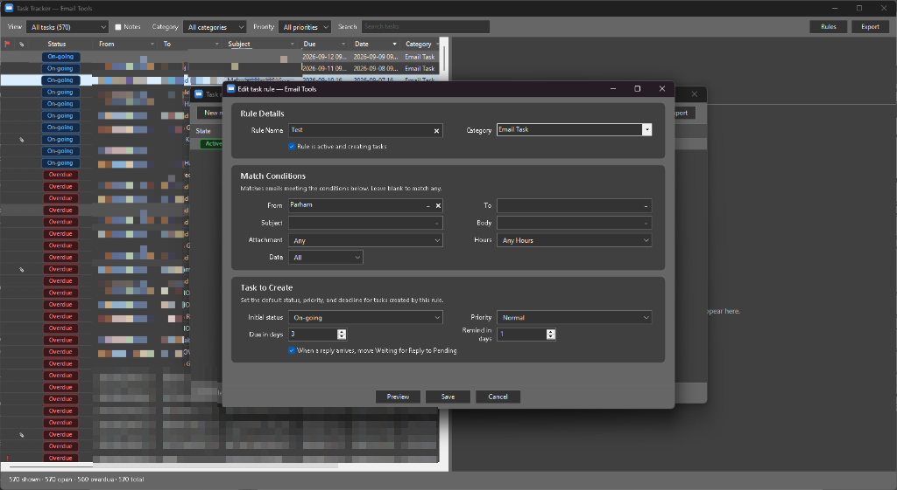
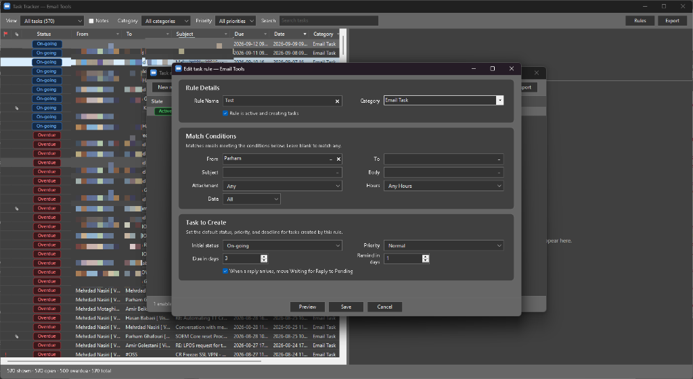

  
<a href="https://parhamghafouri.github.io/EmailTools/">English</a> &nbsp;|&nbsp; <a href="https://parhamghafouri.github.io/EmailTools/README.fa.html"><strong>فارسی</strong></a>

  

  <h1 align="center" style="text-align: center;" dir="rtl">ابزارهای ایمیل برای مایکروسافت اوت‌لوک</h1>
  

    <strong>جست‌وجوی زیر ۱۰ میلی‌ثانیه &bull; ردیابی خودکار وظایف &bull; بایگانی فصلی هوشمند &bull; همگام‌سازی نام‌های سازمانی GAL</strong> 
    <em>مجموعه ابزارهای حرفه‌ای، با کارایی فوق‌العاده بالا و کاملاً محلی (حفظ ۱۰۰٪ حریم خصوصی) برای مایکروسافت اوت‌لوک.</em>
  

  

    &nbsp;&nbsp; &nbsp;&nbsp;
  

  

    <strong>نصب اختصاصی برای هر کاربر</strong> &bull; بدون نیاز به دسترسی ادمین (Administrator) &bull; ۱۰۰٪ آفلاین و محلی &bull; به‌روزرسانی هوشمند و بدون اختلال
  

---

<h2 dir="rtl" align="right">🚀 معرفی افزونه</h2>

اوت‌لوک بستر اصلی مکاتبات اداری و سازمانی است، اما مدیریت صندوق‌های بزرگ و پر رفت‌وآمد همواره با چالش‌هایی جدی همراه است: جست‌وجوی پیش‌فرض ویندوز در میان سال‌ها تاریخچهٔ ایمیل کند و ناقص عمل می‌کند؛ پیگیری اقدام‌های فوری و تعهدات کاری در میان انبوه پیام‌ها گم می‌شود؛ هشدارهای سهمیهٔ مجاز صندوق (Quota) مدام کار را متوقف می‌کند؛ در پاسخ دادن (Reply) فایل‌های ضمیمهٔ قبلی حذف می‌شوند؛ و با تغییر سمت یا نام همکاران، نام‌های قدیمی در دیدگاه‌ها و قوانین باقی می‌مانند.

افزونهٔ <strong>Email Tools</strong> مستقیماً در نوار ابزار اوت‌لوک ادغام شده و تمام این چالش‌ها را بدون نیاز به سرورهای خارجی، دسترسی مدیر سیستم (IT Admin) یا تحمیل بار اضافه به رایانه برطرف می‌سازد. همهٔ پردازش‌ها به صورت کاملاً محلی انجام شده و <strong>سرعت جست‌وجوی زیر ۱۰ میلی‌ثانیه</strong>، <strong>سیستم هوشمند ردیابی وظایف کاری</strong>، <strong>بایگانی فصلی خودکار</strong>، و <strong>همگام‌سازی بی‌درنگ نام‌ها با GAL</strong> را برای شما به ارمغان می‌آورد.

  

---

<h2 dir="rtl" align="right">✨ جدول مقایسه قابلیت‌ها</h2>

<table dir="rtl" align="right" width="100%">
  <thead>
    <tr>
      <th align="right" width="25%">قابلیت</th>
      <th align="right" width="35%">اوت‌لوک پیش‌فرض</th>
      <th align="right" width="40%">اوت‌لوک همراه با Email Tools</th>
    </tr>
  </thead>
  <tbody>
    <tr>
      <td><strong>جست‌وجوی متن ایمیل‌ها</strong></td>
      <td>کند و ناقص در آرشیوهای متصل یا فایل‌های ایندکس‌نشده</td>
      <td><strong>آنی (زیر ۱۰ میلی‌ثانیه)</strong> با موتور محلی SQLite FTS5 در تمام صندوق‌ها و PSTها</td>
    </tr>
    <tr>
      <td><strong>ردیابی وظایف و پیگیری‌ها</strong></td>
      <td>پرچم‌گذاری دستی بدون دسته‌بندی و وضعیت‌بندی پویا</td>
      <td><strong>ردیاب هوشمند وظایف (Task Tracker)</strong> با قوانین خودکار، کارت‌های کانبان و تشخیص خودکار پاسخ</td>
    </tr>
    <tr>
      <td><strong>فیلتر فایل‌های پیوست</strong></td>
      <td>جست‌وجوی سطحی بدون امکان تفکیک بر اساس پسوند فایل</td>
      <td><strong>جست‌وجوی پیشرفته با حروف عام</strong> (مانند <code>*.pdf</code> و <code>*.xlsx</code>) و حذف نویز تصاویر امضا</td>
    </tr>
    <tr>
      <td><strong>مدیریت سهمیه (Quota)</strong></td>
      <td>هشدارهای مداوم پر شدن صندوق و نیاز به حذف دستی</td>
      <td><strong>بایگانی هوشمند فصلی</strong> در فایل‌های PST با چرخش خودکار در سقف ۴۵ گیگابایت</td>
    </tr>
    <tr>
      <td><strong>پایش وضعیت ذخیره‌سازی</strong></td>
      <td>مدفون در بخش تنظیمات عمیق حساب کاربری</td>
      <td><strong>نمایشگر مدرن وضعیت Fluent 2</strong> با گیج‌های گرافیکی سهمیه و وضعیت فضای درایو</td>
    </tr>
    <tr>
      <td><strong>پاسخ همراه با پیوست</strong></td>
      <td>پیوست‌ها حذف شده و باید دوباره دستی اضافه شوند</td>
      <td><strong>یک کلیک روی Reply / Reply All with Attachments</strong> در نوار ابزار اصلی Home</td>
    </tr>
    <tr>
      <td><strong>فوروارد بدون فایل‌های حجیم</strong></td>
      <td>حذف دستی و تک‌به‌تک فایل‌های پیوست پیش از ارسال</td>
      <td><strong>یک کلیک روی Forward without Attachments</strong> با حفظ هوشمند تصاویر امضا</td>
    </tr>
    <tr>
      <td><strong>به‌روزرسانی نام‌ها با GAL</strong></td>
      <td>باقی ماندن نام‌های قدیمی افراد در مکاتبات پیشین و Ruleها</td>
      <td><strong>همگام‌سازی خودکار با دفترچه تلفن سازمانی (GAL)</strong> در زمان بی‌کاری سیستم در پس‌زمینه</td>
    </tr>
    <tr>
      <td><strong>خلوت‌سازی قبل از مرخصی</strong></td>
      <td>انتقال دستی و زمان‌بر پوشه‌ها</td>
      <td><strong>حالت مرخصی (Vacation Mode)</strong> با یک کلیک ایمیل‌های اخیر را نگه داشته و مابقی را آرشیو می‌کند</td>
    </tr>
    <tr>
      <td><strong>یادآورهای جلسات گذشته</strong></td>
      <td>تجمع پنجره‌های یادآور برای جلساتی که تمام شده‌اند</td>
      <td><strong>بستن خودکار و بی‌صدا</strong>ی یادآورهای جلسات سپری‌شده</td>
    </tr>
    <tr>
      <td><strong>حریم خصوصی داده‌ها</strong></td>
      <td>وابسته به تنظیمات سرویس‌های ابری</td>
      <td><strong>۱۰۰٪ محلی و آفلاین</strong>؛ بدون ارسال حتی یک بایت داده به بیرون</td>
    </tr>
  </tbody>
</table>

---

<h2 dir="rtl" align="right">🔍 راهنمای بخش‌های کلیدی</h2>

<h3 dir="rtl" align="right">۱. جست‌وجوی پیشرفته (Advanced Search با سرعت زیر ۱۰ میلی‌ثانیه)</h3>

یک پنجرهٔ مستقل با سرعت پردازش فوق‌العاده، نوار فیلترهای جامع، مرتب‌سازی آنی، جدول نتایج با پشتیبانی تا ۱۰۰,۰۰۰ ردیف بدون افت فریم، و پیش‌نمایش کاملاً امن به سبک اوت‌لوک.

  
   
  <em>اجرای آنی کوئری‌ها در سراسر صندوق‌های پستی، فایل‌های آرشیو PST متصل و تاریخچهٔ گفت‌وگوها.</em>

<ul dir="rtl" align="right">
  <li><strong>موتور ایندکس SQLite FTS5 Trigram:</strong> ایندکس متنی محلی با حجم بسیار کم که متن کامل پیام‌ها را بدون دانلود یا بازکردن مجدد در چند میلی‌ثانیه می‌یابد.</li>
  <li><strong>فیلتر اختصاصی نام و پسوند پیوست:</strong> جست‌وجوی مستقیم در نام فایل‌های ضمیمه با الگوهای Wildcard (مانند <code>*.pdf</code> یا <code>*.xlsx</code>) همراه با فیلتر خودکار تصاویر امضا.</li>
  <li><strong>پیش‌نمایش امن ایزوله‌شده (Sandboxed Preview):</strong> دارای برچسب Mark-of-the-Web جهت مسدودسازی اجرای اسکریپت‌ها، تله‌متری و درخواست‌های مشکوک شبکه.</li>
  <li><strong>برجسته‌سازی و کلیدهای پرش:</strong> هایلایت واژه‌های جست‌وجوشده در پیش‌نمایش و جابه‌جایی سریع میان تطابق‌ها با دکمه‌های Previous / Next.</li>
  <li><strong>ترکیب فیلترها:</strong> امکان جست‌وجوی همزمان بر اساس فرستنده، گیرنده، رونوشت، موضوع، متن، نام پیوست، بازهٔ تاریخ و ساعات مشخص روز.</li>
  <li><strong>منوی راست‌کلیک کامل:</strong> باز کردن، پاسخ، فوروارد، پرچم‌گذاری، دسته‌بندی رنگی، انتقال، حذف، نمایش گفت‌وگوهای مرتبط و خروجی اکسل (CSV) با محافظت ضدتزریق فرمول.</li>
</ul>

---

<h3 dir="rtl" align="right">۲. ردیاب هوشمند وظایف و خودکارسازی کارها (Task Tracker)</h3>

تبدیل ایمیل‌های کاری به وظایف مشخص با موعد مقرر، اولویت‌بندی و پایش وضعیت پیگیری‌ها. این ابزار از فراموش شدن درخواست‌های حیاتی یا پاسخ‌های معلق جلوگیری می‌کند.

  
   
  <em>کارت‌های خلاصه وضعیت به سبک کانبان، جدول شفاف وظایف و پنل جانبی بررسی زمینهٔ کامل مکاتبه.</em>

<ul dir="rtl" align="right">
  <li><strong>کارت‌های آماری وضعیت به سبک کانبان:</strong> دسته‌بندی بصری وظایف در وضعیت‌های <strong>برای انجام (To Do)</strong>، <strong>در حال انجام (In Progress)</strong>، <strong>در انتظار پاسخ (Waiting for Reply)</strong>، <strong>انجام‌شده (Completed)</strong> و <strong>معوق/سررسیدگذشته (Overdue)</strong> با شمارنده‌های زنده.</li>
  <li><strong>ویرایشگر پیشرفتهٔ قوانین خودکارسازی:</strong> تعریف قوانین دقیق برای تبدیل خودکار ایمیل‌های دریافتی یا ارسالی به وظیفه، بر اساس فرستنده، گیرنده، کلمات کلیدی موضوع یا متن، پسوند فایل‌های پیوست و مهلت انجام.</li>
  <li><strong>تغییر وضعیت خودکار با دریافت پاسخ (Auto-Resolve on Reply):</strong> با رسیدن پاسخ به ایمیلی که منتظر بازخورد آن بوده‌اید، وظیفه به صورت خودکار از حالت «در انتظار» خارج شده و به گردش کار فعال بازمی‌گردد.</li>
  <li><strong>پنل جامع بررسی جزئیات:</strong> مشاهدهٔ دقیق موضوع، فرستنده، گیرندگان اصلی و رونوشت، مهلت انجام، یادداشت‌های شخصی و امکان پرش مستقیم به ایمیل در اوت‌لوک.</li>
  <li><strong>طراحی مدرن ویندوز ۱۱:</strong> هماهنگ با زبان طراحی Fluent 2 مایکروسافت، گوشه‌های کاملاً گرد، حاشیه‌های نرم آنتی‌الیاس و سازگاری کامل با تم‌های روشن، خاکستری و مشکی.</li>
</ul>

  
   
  <em>پنجرهٔ طراحی قوانین با پشتیبانی از شروط ترکیبی، استثناها، تعیین اولویت و تنظیم بازه‌های سررسید پیش‌فرض.</em>

---

<h3 dir="rtl" align="right">۳. بایگانی هوشمند (Smart Archive) و مدیریت ظرفیت</h3>

پایان قطعی اخطارهای پر شدن سهمیهٔ صندوق. ایمیل‌های قدیمی به طور منظم و خودکار به فایل‌های آرشیو فصلی محلی (مانند <code>2026-Season1.pst</code>) منتقل می‌شوند.

  

<ul dir="rtl" align="right">
  <li><strong>داشبورد مدرن وضعیت و سلامت (Fluent 2):</strong> گیج‌های تصویری پیشرفت، نمایش سهمیهٔ فعال با رنگ‌های هشداردهندهٔ سبز/نارنجی/قرمز و نوار ظرفیت آزاد درایو آرشیو.</li>
  <li><strong>شتاب‌بخشی هوشمند به چرخه بایگانی:</strong> بررسی سن قدیمی‌ترین ایمیل‌ها و پرش از بازه‌های زمانی خالی، همراه با اولویت‌بندی از قدیمی‌ترین تاریخ در زمان پر شدن صندوق.</li>
  <li><strong>حفاظت اضطراری از سهمیه (Emergency Quota):</strong> آغاز فوری عملیات بایگانی در صورت رسیدن حجم صندوق به ۹۰٪ سهمیه مجاز، تا بازگشت به زیر آستانهٔ امن تنظیمی.</li>
  <li><strong>بخش‌بندی فصلی و سقف ۴۵ گیگابایت:</strong> تفکیک آرشیو هر سال به ۴ فصل و جابه‌جایی خودکار به فایل جدید در سقف ۴۵ گیگابایت برای پیشگیری از آسیب به فایل‌های PST.</li>
  <li><strong>وقفهٔ ایمن ۲ ساعته:</strong> توقف کامل اسکن‌های مداوم پس از رسیدن صندوق به حجم ایمن تنظیمی جهت جلوگیری از درگیری بیهودهٔ دیسک و پردازنده.</li>
  <li><strong>پنجره‌های با گوشه‌های گرد و سبک:</strong> باز شدن آنی بدون ایجاد وقفه یا فریز در عملکرد اصلی اوت‌لوک.</li>
</ul>

  
  &nbsp;&nbsp;&nbsp;&nbsp;
  

---

<h3 dir="rtl" align="right">۴. عملیات یک‌کلیکی فایل‌های پیوست در ریبون Home</h3>

سه دکمهٔ پرکاربرد مستقیماً در زبانهٔ اصلی اوت‌لوک برای افزایش سرعت مکاتبات روزمره:

  

<ul dir="rtl" align="right">
  <li><strong>پاسخ با پیوست‌ها (Reply with Attachment):</strong> ایجاد ایمیل پاسخ در حالی که تمام فایل‌های پیوست پیام اصلی عینا تکثیر و حفظ می‌شوند.</li>
  <li><strong>پاسخ به همه با پیوست‌ها (Reply All with Attachment):</strong> ارسال پاسخ برای تمام افراد حاضر در رونوشت همراه با فایل‌های اصلی.</li>
  <li><strong>فوروارد بدون پیوست (Forward without Attachment):</strong> حذف فایل‌های حجیم برای صرفه‌جویی در پهنای باند با حفظ هوشمندانهٔ تصاویر امضای شرکتی.</li>
</ul>

---

<h3 dir="rtl" align="right">۵. همگام‌سازی نام‌های نمایشی با GAL بدون اختلال</h3>

هنگامی که همکاران در دایرکتوری سازمانی (Active Directory / Exchange GAL) نام، نام خانوادگی یا واحد سازمانی خود را تغییر می‌دهند، نام‌های قدیمی در پیام‌های گذشته، قوانین و فیلترهای اوت‌لوک باقی می‌مانند.

<ul dir="rtl" align="right">
  <li><strong>انطباق ایمن آدرس‌ها:</strong> شناسایی دقیق آدرس ایمیل در دفترچه تلفن سازمانی (GAL) و به‌روزرسانی نام تنها در صورت تطابق قطعی یک‌به‌یک.</li>
  <li><strong>اصلاح قوانین و دیدگاه‌ها در خارج از پروسهٔ اصلی:</strong> اصلاح قوانین (Rules)، پوشه‌های جست‌وجو (Search Folders) و نماها (Views) پس از بسته شدن اوت‌لوک برای جلوگیری از قفل‌شدن رابط کاربری.</li>
  <li><strong>ذخیرهٔ چک‌پوینت‌های پیشرفت:</strong> ذخیره‌سازی منظم وضعیت انجام عملیات تا در صورت راه‌اندازی مجدد ویندوز، فرایند از همان نقطه ادامه یابد.</li>
</ul>

---

<h3 dir="rtl" align="right">۶. حالت مرخصی (Vacation Mode) و پاک‌سازی یادآورها</h3>

  

<ul dir="rtl" align="right">
  <li><strong>حالت مرخصی (Vacation Mode):</strong> سبک‌سازی صندوق ورودی پیش از عزیمت به مرخصی؛ نگه‌داشتن درصد مشخصی از پیام‌های جدید (مثلاً ۱۰٪ آخر) و بایگانی امن باقی پیام‌ها.</li>
  <li><strong>بستن خودکار یادآورهای معوق:</strong> بستن بی‌صدا و خودکار پنجره‌های هشدار تقویم برای جلساتی که زمان آن‌ها سپری شده است.</li>
</ul>

---

<h2 dir="rtl" align="right">📦 راهنمای نصب و ارتقا</h2>

<h3 dir="rtl" align="right">نصب اولیه</h3>
<ol dir="rtl" align="right">
  <li>فایل <strong><code>EmailTools_Setup.rar</code></strong> را از بخش <a href="https://github.com/ParhamGhafouri/EmailTools/releases/latest/download/EmailTools_Setup.rar">آخرین نسخه (Latest Release)</a> دانلود کنید.</li>
  <li>فایل را استخراج کرده و <strong><code>EmailTools_Setup.exe</code></strong> را اجرا نمایید.</li>
  <li>مایکروسافت اوت‌لوک را باز کنید؛ زبانهٔ <strong>Email Tools</strong> آمادهٔ استفاده است.</li>
</ol>

<h3 dir="rtl" align="right">ارتقا از نسخه‌های پیشین</h3>
<ul dir="rtl" align="right">
  <li><strong>نیازی به حذف نسخهٔ قبلی نیست.</strong> اجرای فایل نصب جدید به صورت خودکار اوت‌لوک را بسته، فایل‌های برنامه را ارتقا داده و پایگاه‌داده و تنظیمات قبلی شما را بدون کوچک‌ترین تغییری حفظ می‌کند.</li>
  <li><strong>مهاجرت خودکار ساختار داده‌ها:</strong> ساختار ایندکس و جداول به صورت خودکار و زیر ۱۵ میلی‌ثانیه به نسخهٔ جدید ارتقا می‌یابد.</li>
</ul>

---

<h2 id="requirements" dir="rtl" align="right">💻 پیش‌نیازهای سیستم</h2>

<table dir="rtl" align="right" width="100%">
  <thead>
    <tr>
      <th align="right" width="30%">مشخصه</th>
      <th align="right" width="70%">حداقل نیازمندی</th>
    </tr>
  </thead>
  <tbody>
    <tr>
      <td><strong>سیستم‌عامل</strong></td>
      <td>ویندوز ۱۰ یا ویندوز ۱۱ (نسخه‌های ۳۲ بیتی و ۶۴ بیتی)</td>
    </tr>
    <tr>
      <td><strong>مایکروسافت اوت‌لوک</strong></td>
      <td>اوت‌لوک ۲۰۱۶، ۲۰۱۹، ۲۰۲۱ یا کلاینت دسکتاپ مایکروسافت ۳۶۵</td>
    </tr>
    <tr>
      <td><strong>بستر اجرایی</strong></td>
      <td>مایکروسافت دات‌نت فریم‌ورک نسخه ۴.۸ یا جدیدتر</td>
    </tr>
    <tr>
      <td><strong>سطح دسترسی کاربر</strong></td>
      <td><strong>کاربر عادی (Standard User)</strong> - بدون نیاز به دسترسی Administrator</td>
    </tr>
  </tbody>
</table>

---

<h2 id="security" dir="rtl" align="right">🛡️ حریم خصوصی، امنیت و معماری</h2>

مجموعهٔ Email Tools با تعهد کامل به حاکمیت داده‌ها و بالاترین استانداردهای امنیتی سازمانی طراحی شده است:

<ul dir="rtl" align="right">
  <li><strong>اجرای ۱۰۰٪ محلی (On-Premise / Local):</strong> تمامی کوئری‌های دیتابیس، ایندکس‌گذاری متن پیام‌ها و عملیات بایگانی صرفاً بر روی رایانهٔ محلی شما انجام می‌شود.</li>
  <li><strong>عدم نشت داده به ابَر:</strong> هیچ بخشی از متن ایمیل‌ها، پیوست‌ها یا اطلاعات آماری به هیچ سرور خارجی یا ابری ارسال نمی‌گردد.</li>
  <li><strong>موتور پیش‌نمایش ایزوله‌شده:</strong> پیش‌نمایش ایمیل‌ها تحت سیاست Mark-of-the-Web و با مهار اسکریپت‌ها، تصاویر ردگیر (Web Beacons) و درخواست‌های نامطمئن شبکه نمایش داده می‌شود.</li>
  <li><strong>امضای دیجیتال معتبر (Authenticode):</strong> تمامی باینری‌های اجرایی (از جمله <code>EmailTools.dll</code>، <code>EmailTools.NameRepairWorker.exe</code> و فایل نصبی) دارای امضای دیجیتال معتبر با گواهی Authenticode و تایم‌استمپ رسمی RFC 3161 هستند.</li>
</ul>

---

  <h2 align="center" style="text-align: center;" dir="rtl">🌟 پشتیبانی و مشارکت</h2>

  

    اگر ابزارهای Email Tools در صرفه‌جویی زمان یا مدیریت حجم ایمیل‌هایتان به شما کمک کرده است، لطفاً با دادن یک ستاره (Star) به این مخزن در گیت‌هاب از پروژه حمایت کنید!
  

  

    
  

  

  

    <strong>معماری و توسعه توسط پرهام غفوری</strong> 
    &nbsp; 
    &copy; Parham Ghafouri. Released as Freeware under the MIT-compatible open software license.
  

