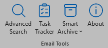
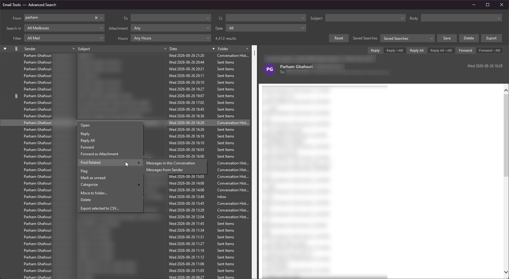
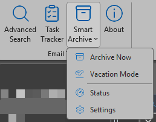
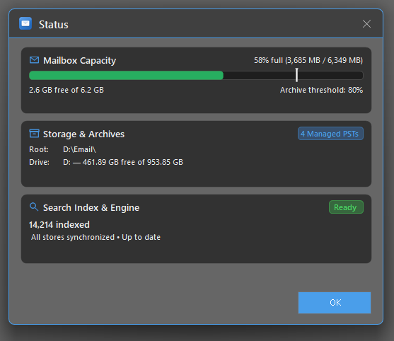
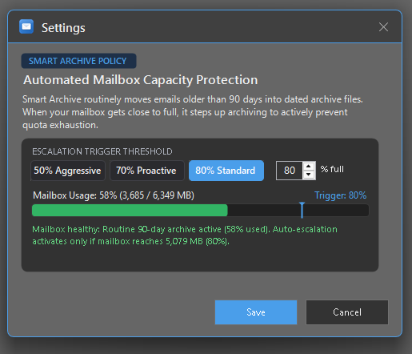
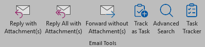
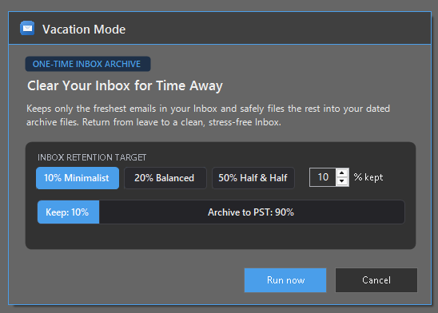

  <a href="https://parhamghafouri.github.io/EmailTools/"><strong>English</strong></a> &nbsp;|&nbsp;
  <a href="https://parhamghafouri.github.io/EmailTools/README.fa.html"><strong>فارسی</strong></a>

  

<h1 align="center" dir="rtl">ابزارهای ایمیل برای مایکروسافت اوت‌لوک</h1>

  <strong>جست‌وجوی زیر ۱۰ میلی‌ثانیه &bull; فیلتر پیشرفتهٔ فایل‌های پیوست &bull; بایگانی فصلی خودکار &bull; همگام‌سازی نام‌های سازمانی GAL</strong> 
  <em>مجموعه ابزارهای حرفه‌ای، با کارایی فوق‌العاده بالا و کاملاً محلی (حفظ ۱۰۰٪ حریم خصوصی) برای مایکروسافت اوت‌لوک.</em>

  
  
  
  
  
  

  
  &nbsp;
  

  <strong>نصب اختصاصی برای هر کاربر</strong> &bull; بدون نیاز به دسترسی ادمین (Administrator) &bull; ۱۰۰٪ آفلاین و محلی &bull; به‌روزرسانی هوشمند و بدون اختلال

---

## 🚀 معرفی و چرایی توسعه

اوت‌لوک بستر اصلی مکاتبات روزمره سازمانی است؛ با این حال، با افزایش حجم ایمیل‌ها، مسائلی مانند کندی شدید یا شکست ایندکس پیش‌فرض ویندوز، هشدارهای مداوم پر شدن سهمیه (Quota)، حذف ناخواستهٔ فایل‌های پیوست هنگام Reply، و قدیمی ماندن نام افراد در Ruleها و Search Folderها به چالش‌هایی روزمره تبدیل می‌شوند.

افزونهٔ **Email Tools** به عنوان یک بستهٔ نرم‌افزاری سبک و فوق‌العاده سریع به صورت Native برای اوت‌لوک توسعه داده شده است تا تمامی این کمبودها را بدون نیاز به سرورهای جانبی یا دسترسی مدیر سیستم (IT Admin) حل کند. کلیهٔ پردازش‌ها به صورت کاملاً محلی بر روی رایانه شما انجام می‌شود و امکاناتی چون **جست‌وجوی زیر ۱۰ میلی‌ثانیه‌ای متن و فایل‌های پیوست**، **بایگانی فصلی هوشمند**، **عملیات یک‌کلیکی روی فایل‌های ضمیمه** و **هماهنگ‌سازی پایگاه نام سازمانی (GAL)** را در اختیارتان می‌گذارد.

  

---

## ✨ جدول مقایسه اوت‌لوک ساده با افزونه Email Tools

| قابلیت | اوت‌لوک پیش‌فرض | اوت‌لوک همراه با Email Tools |
| :--- | :--- | :--- |
| **جست‌وجوی بدنهٔ پیام‌ها** | کند، ناموفق در آرشیوهای متصل یا فایل‌های ایندکس‌نشده | **آنی (زیر ۱۰ میلی‌ثانیه)** با ایندکس محلی سه‌حرفی SQLite FTS5 در تمام صندوق‌ها و آرشیوها |
| **جست‌وجوی فایل‌های پیوست** | ناکارآمد، بدون قابلیت فیلتر بر اساس پسوند | **جست‌وجوی اختصاصی و فوری** با الگوهای Wildcard (مانند `*.pdf`، `*.xlsx` و ...) |
| **پر شدن صندوق و Quota** | هشدارهای آزاردهنده و حذف دستی وقت‌گیر | **بایگانی خودکار فصلی و اضطراری** در فایل‌های PST بخش‌بندی‌شدهٔ ۴۵ گیگابایتی |
| **پاسخ همراه با فایل‌های پیوست** | پیوست‌ها حذف می‌شوند و باید دستی اضافه شوند | **یک کلیک روی Reply / Reply All with Attachments** مستقیماً در ریبون Home |
| **فوروارد بدون فایل‌های سنگین** | حذف دستی تک‌تک فایل‌ها برای کاهش حجم | **یک کلیک روی Forward without Attachments** (با حفظ تصاویر امضا) |
| **تغییر نام افراد در سازمان** | نام‌های قدیمی در ایمیل‌های پیشین و Ruleها می‌مانند | **همگام‌سازی خودکار با GAL** در زمان بی‌کاری سیستم در پس‌زمینه |
| **آمادگی برای مرخصی** | نیاز به تفکیک و جابه‌جایی دستی ایمیل‌ها | **حالت مرخصی (Vacation Mode)** با یک کلیک ایمیل‌های اخیر را نگه داشته و بقیه را آرشیو می‌کند |
| **یادآورهای جلسات گذشته** | انباشت پنجره‌های هشدار جلساتی که تمام شده‌اند | **پاک‌سازی و بستن خودکار و بی‌صدا**ی یادآورهای منقضی‌شده |
| **حریم خصوصی و داده‌ها** | بسته به سرویس‌های ابری متفاوت است | **۱۰۰٪ محلی و آفلاین**؛ بدون ارسال حتی یک بایت به بیرون یا سرورهای ثالث |

---

## 🔍 راهنمای بخش‌های کلیدی محصول

### ۱. جست‌وجوی پیشرفته (Advanced Search با سرعت زیر ۱۰ میلی‌ثانیه)

یک پنجرهٔ جست‌وجوی اختصاصی و کاملاً مستقل از پردازشگر اصلی اوت‌لوک با نوار فیلترهای کامل، مرتب‌سازی آنی، جدول نتایج مجازی (پشتیبانی تا ۱۰۰,۰۰۰ ایمیل بدون افت فریم)، و پیش‌نمایش کاملاً امن و ایزوله.

  
   
  <em>اجرای آنی کوئری‌ها در سراسر صندوق‌های پستی، فایل‌های آرشیو PST متصل و تاریخچهٔ گفت‌وگوها.</em>

* **موتور ایندکس SQLite FTS5 Trigram:** ایندکس متنی بسیار فشرده و کارآمد که امکان جست‌وجوی کلمات را در عرض چند میلی‌ثانیه بدون نیاز به بازکردن یا دانلود مجدد پیام‌ها فراهم می‌کند.
* **فیلتر اختصاصی نام و پسوند فایل پیوست:** جست‌وجوی مستقیم در نام فایل‌های ضمیمه با پشتیبانی از حروف عام (مانند `*.pdf`، `invoice` یا `*.xlsx`) همراه با فیلتر خودکار تصاویر امضا جهت جلوگیری از نتایج نامربوط.
* **پیش‌نمایش امن ایزوله‌شده (Sandboxed Preview):** دارای برچسب Mark-of-the-Web جهت مسدودسازی کدهای اسکریپت، پیکسل‌های ردیابی وب و درخواست‌های غیرمجاز شبکه.
* **هایلایت هوشمند و کلیدهای پرش:** برجسته‌سازی کلمات جست‌وجوشده در متن پیش‌نمایش همراه با کلیدهای **Previous / Next** برای جابه‌جایی سریع میان تطابق‌ها.
* **ترکیب جامع شروط:** امکان ترکیب آزادانه فیلترهای فرستنده، گیرنده، رونوشت، موضوع، متن، نام پیوست، بازه زمانی و ساعت ارسال.
* **منوی عملیات راست‌کلیک:** بازکردن، پاسخ، فوروارد، پرچم‌گذاری، دسته‌بندی رنگی، انتقال، حذف، نمایش گفت‌وگوهای مرتبط و خروجی اکسل (CSV) با محافظت در برابر تزریق فرمول.

---

### ۲. بایگانی هوشمند (Smart Archive) و مدیریت سهمیه

دیگر نگران پر شدن سهمیه صندوق پستی یا دریافت ایمیل‌های اخطار Quota نباشید. افزونه ایمیل‌های قدیمی را به شکلی تمیز و تفکیک‌شده به آرشیوهای محلی فصلی (مانند `2026-Season1.pst`) منتقل می‌کند.

  

* **شتاب‌بخشی هوشمند به چرخه بایگانی:** شناسایی خودکار سن قدیمی‌ترین ایمیل‌ها و پرش از بازه‌های زمانی خالی، همراه با اولویت‌بندی انتقال از قدیمی‌ترین تاریخ.
* **حفاظت اضطراری از سهمیه (Emergency Quota):** فعال‌سازی خودکار در صورت رسیدن حجم به ۹۰٪ سهمیه جهت آزادسازی سریع فضا تا زیر آستانهٔ امن تنظیمی کاربر.
* **چرخش فصلی و سقف ۴۵ گیگابایت:** دسته‌بندی خودکار هر سال به ۴ فصل (`YYYY-Season1` تا `Season4`) و ایجاد فایل جدید در صورت رسیدن حجم PST به ۴۵ گیگابایت جهت حفظ سلامت دیتابیس اوت‌لوک.
* **وقفهٔ ایمن ۲ ساعته:** جلوگیری از اجرای مکرر و چرخش بیهوده دیسک پس از سبک شدن و رسیدن صندوق به وضعیت امن.
* **پنجره‌های سبک و سریع:** مشاهدهٔ آنی وضعیت فضای ذخیره‌سازی، مصرف صندوق، و درصد پیشرفت ایندکس بدون کوچک‌ترین افت سرعت در اوت‌لوک.

  
  &nbsp;&nbsp;&nbsp;&nbsp;
  

---

### ۳. ابزارهای یک‌کلیکی فایل‌های پیوست در ریبون Home

دسترسی سریع و آسان به عملیات پرکاربرد پیوست‌ها دقیقاً در زبانهٔ اصلی اوت‌لوک:

  

* **Reply with Attachment(s):** پاسخ به فرستنده با کپی و حفظ خودکار تمامی فایل‌های ضمیمهٔ اصلی.
* **Reply All with Attachment(s):** پاسخ به تمام افراد حاضر در مکاتبه همراه با حفظ کامل پیوست‌ها.
* **Forward without Attachment(s):** فوروارد پیام با حذف فایل‌های سنگین جهت صرفه‌جویی در ترافیک و با حفظ هوشمندانهٔ تصاویر امضاها.

---

### ۴. همگام‌سازی نام‌های سازمانی (GAL Display-Name Sync)

هنگامی که همکاران در اکتیو دایرکتوری یا دفترچه آدرس سراسری سازمان (GAL) تغییر سِمت، فامیلی یا واحد سازمانی پیدا می‌کنند، نام‌های پیشین در تاریخچهٔ ایمیل‌ها، قوانین (Rules)، نماها (Views) و پوشه‌های جست‌وجوی اوت‌لوک دست‌نخورده و قدیمی باقی می‌مانند.

* **تطبیق امن آدرس‌ها:** شناسایی هویت از روی آدرس ایمیل و به‌روزرسانی نام نمایشی تنها در صورت تطابق قطعی و یک‌به‌یک با GAL.
* **اصلاح ایمن در خارج از فرآیند اصلی:** قوانین و نماها پس از بسته‌شدن اوت‌لوک توسط پروسهٔ مستقل و معتبر به‌روزرسانی می‌شوند تا اختلالی در عملکرد کاربر ایجاد نشود.
* **پایداری در قطع و وصل:** ذخیرهٔ منظم پیشرفت عملیات و ادامهٔ خودکار بدون ایجاد لاگ‌های حجیم و افشاکننده.

---

### ۵. حالت مرخصی (Vacation Mode) و پاک‌سازی یادآورها

  

* **حالت مرخصی (Vacation Mode):** سبک‌سازی اینباکس قبل از شروع مرخصی؛ تنها درصد مشخصی از ایمیل‌های جدید را در Inbox نگه داشته و مابقی را با خیال راحت به آرشیو فصلی منتقل می‌کند.
* **پاک‌سازی یادآورهای منقضی:** بستن خودکار هشدارهای تقویم برای جلساتی که در گذشته برگزار شده‌اند تا صبح‌ها با انبوهی از پنجره‌های یادآور مواجه نشوید.

---

## 📦 نحوهٔ نصب و به‌روزرسانی

### نصب اولیه
1. فایل **`EmailTools_Setup.rar`** را از [صفحهٔ آخرین نسخه](https://github.com/ParhamGhafouri/EmailTools/releases/latest/download/EmailTools_Setup.rar) دریافت کنید.
2. فایل را از حالت فشرده خارج کرده و برنامهٔ **`EmailTools_Setup.exe`** را اجرا نمایید.
3. اوت‌لوک را باز کنید؛ زبانهٔ **Email Tools** به نوار ابزار شما اضافه شده است.

### ارتقا از نسخه‌های پیشین
* **نیازی به حذف نسخهٔ قبلی نیست.** کافی است فایل نصبی نسخه جدید را اجرا کنید؛ ستاپ به طور خودکار اوت‌لوک را بسته، افزونه را به‌روزرسانی کرده و تمامی دیتابیس‌ها و تنظیمات قبلی شما را بدون تغییر حفظ می‌کند.
* **دیتابیس خودترمیم:** به‌روزرسانی‌های ساختار ایندکس (مانند مایگریشن پیوست‌ها در v1.1.2) در کمتر از ۱۵ میلی‌ثانیه بدون نیاز به بازخوانی طولانی ایمیل‌ها انجام می‌شود.

---

## 💻 پیش‌نیازهای سیستمی

| مشخصه | حداقل سیستم مورد نیاز |
| :--- | :--- |
| **سیستم عامل** | ویندوز ۱۰ یا ویندوز ۱۱ (نسخه‌های ۳۲ یا ۶۴ بیتی) |
| **مایکروسافت اوت‌لوک** | اوت‌لوک ۲۰۱۶، ۲۰۱۹، ۲۰۲۱ یا مایکروسافت ۳۶۵ دسکتاپ |
| **محیط اجرایی** | مایکروسافت دات‌نت فریم‌ورک نسخه ۴.۸ یا بالاتر |
| **سطح دسترسی ویندوز** | **کاربر عادی** (بدون نیاز به دسترسی ادمین / Administrator) |

---

## 🛡️ امنیت، حریم خصوصی و معماری

این افزونه با بالاترین استانداردهای سازمانی جهت حفاظت از داده‌ها طراحی شده است:

* **اجرای ۱۰۰٪ محلی:** کلیهٔ کوئری‌های پایگاه داده، ایندکس‌گذاری FTS5 و منطق آرشیو صرفاً بر روی رایانه شما اجرا می‌شود.
* **عدم خروج اطلاعات:** هیچ متنی، تله‌متری، یا متادیتایی به هیچ سروری در اینترنت ارسال نمی‌شود.
* **ایزوله‌سازی پیش‌نمایش:** موتور نمایش متن ایمیل‌ها دارای محافظت Mark-of-the-Web برای جلوگیری از اجرای اسکریپت‌ها و درخواست‌های ناخواسته است.
* **امضای دیجیتال معتبر:** کلیهٔ فایل‌های اجرایی دارای امضای رسمی Authenticode با شناسه گواهی `42536C317058B3308A75D89E19F849B0B08BD39A` و برچسب زمانی معتبر RFC 3161 هستند.
* **حذف فیزیکی قطعی PSTهای تخلیه‌شده:** استفاده از قابلیت سیستمی `MoveFileEx(MOVEFILE_DELAY_UNTIL_REBOOT)` جهت اطمینان از پاک‌سازی قطعی فایل‌های آرشیو قدیمی حتی در صورت قفل بودن توسط ایندکسر ویندوز.

---

## 🌟 حمایت از پروژه

اگر استفاده از Email Tools به خلوت شدن صندوق و افزایش سرعت کار شما با اوت‌لوک کمک کرده است، با دادن ستاره (Star) به این مخزن در گیت‌هاب از پروژه حمایت کنید!

  

---

  <strong>طراحی و توسعه توسط پرهام غفوری</strong> 
  
  
   
  &copy; 2026 Parham Ghafouri. تمامی حقوق محفوظ است. منتشرشده به عنوان نرم‌افزار رایگان (Freeware).

