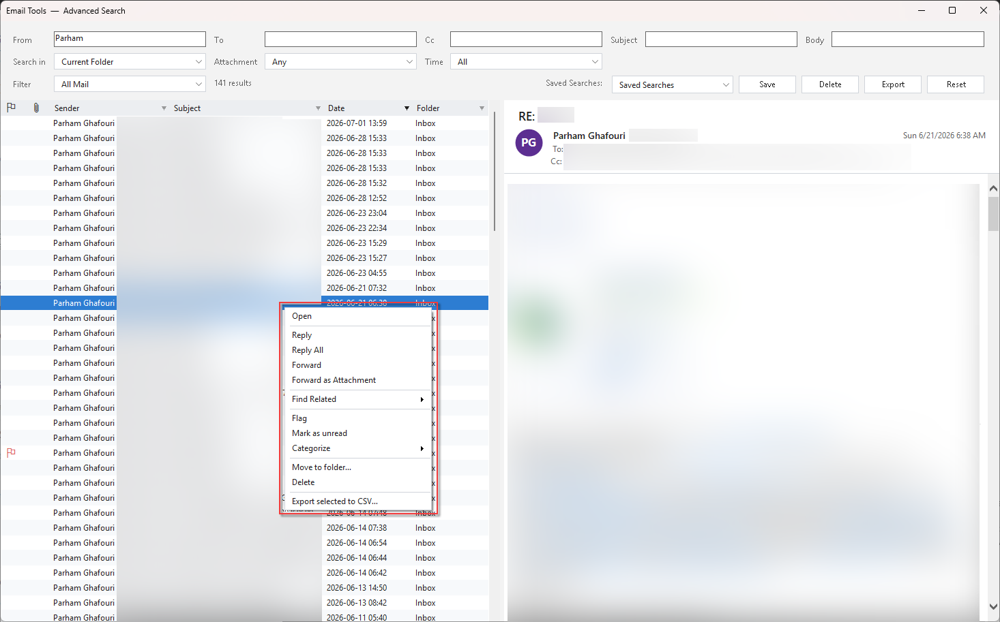
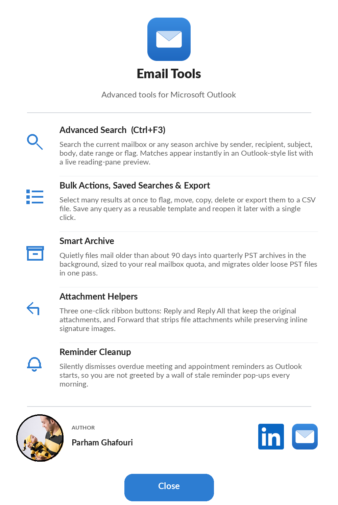

# Email Tools for Microsoft Outlook

**A powerful companion for Microsoft Outlook — advanced indexed search, smart archiving, bulk actions, attachment &amp; meeting preview, and reminder cleanup. Free, and no administrator rights required.**

### [⬇ &nbsp;Download the latest installer](https://github.com/ParhamGhafouri/EmailTools/releases/latest/download/EmailTools_Setup.zip)

Installs for your account only • No admin rights • Updates itself automatically

---

## What is Email Tools?

**Email Tools** is a lightweight add-in that adds a dedicated **Email Tools** tab to the Outlook ribbon, plus a global `Ctrl+F3` shortcut. It brings fast body-indexed search, background mailbox archiving, one-click attachment helpers, and a set of quality-of-life fixes to everyday Outlook — all in a single, self-updating install that needs no administrator rights.

 
Advanced Search — search every mailbox and archive at once, with instant results and bulk actions.

---

## Features

### 🔍 Advanced Search &nbsp;`Ctrl+F3`
Search the current mailbox or any season archive by **sender, recipient, subject, body, date range, or flag**. Matches appear instantly in an Outlook-style list with a **live reading-pane preview** — including message bodies, meeting details, and inline images, faithful to how Outlook itself renders them.

### 📋 Bulk Actions, Saved Searches &amp; Export
Select many results at once to **flag, move, copy, delete, or export them to CSV**. Save any query as a reusable template and reopen it later with a single click.

### 🗂️ Smart Archive
Quietly files mail older than ~90 days into **quarterly PST archives** in the background, sized to your real mailbox quota — the fullness level that triggers it is adjustable. Migrates older loose PST files in one pass. **Nothing is ever deleted**, and protected folders (Calendar, Contacts, Conversation History, and more) are never touched. A one-click **Vacation Mode** clears most of your Inbox before time off.

### 📎 Attachment &amp; Meeting Preview
Click an attachment in the preview to **open it in place** — nested `.msg` messages, images, and text render inline, just like Outlook. Meeting items show **Required / Optional attendees** and a clean when-and-where bar instead of a raw field dump.

### ↩️ Attachment Helpers
Three one-click ribbon buttons: **Reply** and **Reply All** that keep the original attachments, and **Forward** that strips file attachments while preserving inline signature images.

### 🔔 Reminder Cleanup
Silently dismisses overdue meeting and appointment reminders as Outlook starts — no more wall of stale reminder pop-ups every morning.

### 🔄 Automatic Updates
Email Tools checks for new versions in the background and installs them **silently after you close Outlook**. Every update is verified by SHA-256 hash and a pinned code-signing signature before it is ever run. You can also check manually any time from **About → Check for Updates**.

---

## Installation

1. **[Download `EmailTools_Setup.zip`](https://github.com/ParhamGhafouri/EmailTools/releases/latest/download/EmailTools_Setup.zip)** from the latest release.
2. Extract it and run **`EmailTools_Setup.exe`**. Setup installs for **your account only** and needs **no administrator rights**.
3. Once installed, Email Tools keeps itself up to date automatically — you won't need to download it again.
4. Start Outlook. The **Email Tools** tab appears on the ribbon, and background indexing begins automatically.

> **First launch:** Email Tools builds a local search index of your message bodies in small idle batches. Search works immediately for what's already indexed and gets more complete over the first few minutes.

---

## How automatic updates work

Once installed, Email Tools keeps itself current with no effort on your part:

1. Once a day, in the background, it checks this repository for a newer release. If it can't reach the server, it simply tries again later — Outlook is never blocked or slowed.
2. When a newer version exists, the installer is downloaded and **verified** (SHA-256 hash **and** the publisher's code-signing certificate).
3. The verified update installs **automatically after you close Outlook**, so your session is never interrupted.
4. The next time you open Outlook, a short note confirms the new version.

You can trigger a check any time from **Email Tools → About → Check for Updates**.

---

## Requirements

| | |
|---|---|
| **Operating system** | Windows 10 or Windows 11 |
| **Outlook** | Microsoft Outlook 2016, 2019, 2021, or Microsoft 365 (desktop) |
| **Framework** | .NET Framework 4.8 (already present on current Windows) |
| **Privileges** | None — installs per-user |

---

## Frequently asked questions

**Does it move or delete my email?**
Smart Archive only *moves* old mail into local PST archives and never deletes anything. Protected folders (Calendar, Contacts, Tasks, Notes, Conversation History, Drafts, Outbox, Deleted Items, and more) are never archived.

**Will it work without admin rights?**
Yes. Everything installs under your own user account.

**Is my data sent anywhere?**
No. Search indexing is entirely local. The only network calls are the daily update check to this GitHub repository.

**How do I uninstall it?**
Use **Settings → Apps → Email Tools → Uninstall** (or the Start-menu uninstaller). Your mail and archives are left untouched.

---

## Changelog

See the [Releases page](https://github.com/ParhamGhafouri/EmailTools/releases) for the full version history and notes.

---

**Designed and developed by Parham Ghafouri**

 &nbsp; 

© 2026 Parham Ghafouri. All rights reserved.

