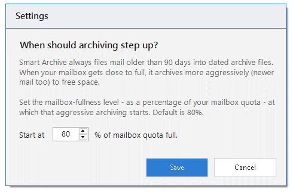

**English** | [فارسی](README.fa.md)

# Email Tools for Microsoft Outlook

**A dedicated search window, one-click attachment replies, and hands-off mailbox archiving — added straight to the Outlook ribbon. Free, per-user, no administrator rights, and it keeps itself up to date.**

### [⬇ &nbsp;Download the latest installer](https://github.com/ParhamGhafouri/EmailTools/releases/latest/download/EmailTools_Setup.zip)

Installs for your account only • No admin rights • Updates itself automatically

⭐ If Email Tools saves you time, please <a href="https://github.com/ParhamGhafouri/EmailTools">star the repo</a> — it takes a second and helps others find it.

---

## What is Email Tools?

**Email Tools** is a lightweight add-in that installs in under a minute (no administrator password, ever). It adds a dedicated **Email Tools** tab to the Outlook ribbon, three attachment buttons on the **Home** tab, and a global **`Ctrl+F3`** shortcut. Everything runs locally on your computer — nothing leaves your machine except the once-a-day check for a new version.

 
Advanced Search — search every mailbox and archive at once, with a live preview and right-click bulk actions.

---

## Features

### 🔍 Advanced Search &nbsp;`Ctrl+F3`
A dedicated search window with the fields on top, results below, and a **live Outlook-style preview** on the right.

- Combine any of **From / To / Cc / Subject / Body**, choose where to look with **Search in** (current folder, whole mailbox, or your archives), and narrow by **Attachment**, **Time** (Today, last 7/30 days, or a custom date range), or **Flagged only**.
- Results show flag &amp; attachment indicators, sender, subject and date; unread rows are bold and every column is sortable.
- The preview renders messages faithfully — inline images, meeting details, and clickable **attachment chips** you can open in place.
- Double-click or press **Enter** to open a message in Outlook.

### 📋 Bulk Actions, Saved Searches &amp; Export
Select one or many results and right-click for a full action menu: **Open, Reply, Reply All, Forward, Forward as Attachment, Find Related** (messages in the same conversation, or everything from that sender), **Flag / Clear flag, Mark read / unread, Categorize, Move, Delete**, and **Export selected to CSV**. Save any query as a reusable **Saved Search**, or **Export** the whole result set to CSV for Excel.

### 📎 Attachment Helpers
Three one-click buttons on the Home tab (and on an open message's ribbon), enabled only when the message actually has attachments:
- **Reply with Attachment(s)** — reply and keep the original files.
- **Reply All with Attachment(s)** — same, to everyone.
- **Forward without Attachment(s)** — forward but strip file attachments, keeping inline signature images.

### 🗂️ Smart Archive
Keeps your mailbox lean by moving older mail into local **quarterly seasonal archives** (e.g. `2025-Season4`, `2026-Season1`) — a separate folder per email account, fully searchable inside Outlook. **Nothing is deleted — mail is moved, not removed.**

- **Automatic:** a few seconds after Outlook starts (once a day), it quietly files mail older than ~90 days. If your mailbox nears full it archives more aggressively to free space — and the fullness level that triggers this is adjustable (**20–80%**, default **80%**). It works in tiny background steps so Outlook never freezes, and turns off Outlook's own AutoArchive so only Email Tools manages your archives.
- **Absorbs old archives:** drop in or open any old `.pst` and Smart Archive migrates its contents into the right seasonal archive, verifies the source is empty, then removes the leftover file.
- **Safe by design:** an old archive is only deleted after **every** item has been moved out and the source is confirmed empty.

Open **Email Tools → Smart Archive** for:
- **Archive Now** — run the full archive immediately in the background and report how many items moved.
- **Vacation Mode** — clears most of your Inbox before time off: keeps the newest part and archives the rest. Runs once, in the background. Nothing is deleted.
- **Status** — shows the archive root, how many accounts are being archived, mailbox size, how many archives are mounted, any legacy archives pending migration, and when it last ran.
- **Settings** — set the mailbox-fullness level (20–80%) at which archiving steps up.

&nbsp;&nbsp;

 
The Smart Archive menu, and the adjustable fullness threshold in Settings.

### 🔔 Reminder Cleanup
Quietly dismisses overdue meeting reminders — the ones for events that already passed — so they don't pile up and nag you every morning. Fully automatic, nothing to configure.

### 🔄 Automatic Updates
Email Tools checks for new versions in the background and installs them **silently after you close Outlook**. Every update is verified by SHA-256 hash **and** a pinned code-signing signature before it is ever run. You can also check any time from the ribbon.

---

## Installation

1. **[Download `EmailTools_Setup.zip`](https://github.com/ParhamGhafouri/EmailTools/releases/latest/download/EmailTools_Setup.zip)** from the latest release.
2. Extract it and run **`EmailTools_Setup.exe`**. Setup installs for your account only, needs **no administrator rights**, and closes Outlook automatically if it's open.
3. Once installed, Email Tools keeps itself up to date — you won't need to download it again.
4. Start Outlook. The **Email Tools** tab appears on the ribbon and the attachment buttons appear on the **Home** tab.

> **First start:** a few seconds after Outlook opens, Smart Archive may run a quiet background tidy and the search index begins building — both in tiny steps so Outlook never freezes.

To **repair or remove**, run `EmailTools_Setup.exe` again for the Maintenance page, or uninstall from **Settings → Apps**. No administrator rights required.

---

## Requirements

| | |
|---|---|
| **Operating system** | Windows 10 or Windows 11 |
| **Outlook** | Microsoft Outlook 2016, 2019, 2021, or Microsoft 365 (desktop) |
| **Framework** | .NET Framework 4.8 (already present on current Windows) |
| **Privileges** | None — installs per-user |

---

## Frequently asked questions

**Does it move or delete my email?**
Smart Archive only *moves* old mail into local archives and never deletes anything. Protected folders (Calendar, Contacts, Tasks, Notes, Conversation History, Drafts, Outbox, Deleted Items, and more) are never archived.

**Will it work without admin rights?**
Yes. Everything installs under your own user account.

**Is my data sent anywhere?**
No. Search indexing and archiving are entirely local. The only network call is the daily update check.

---

## Changelog

See the [Releases page](https://github.com/ParhamGhafouri/EmailTools/releases) for the full version history and notes.

---

### ⭐ Enjoying Email Tools?

**[Star it on GitHub](https://github.com/ParhamGhafouri/EmailTools)** — it's the easiest way to support the project and help more people discover it.

---

**Designed and developed by Parham Ghafouri**

 &nbsp; 

© 2026 Parham Ghafouri. All rights reserved.

